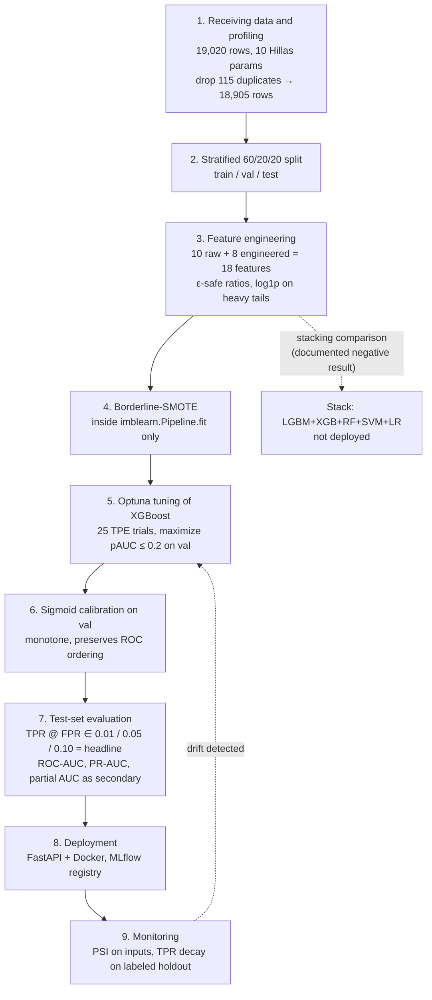
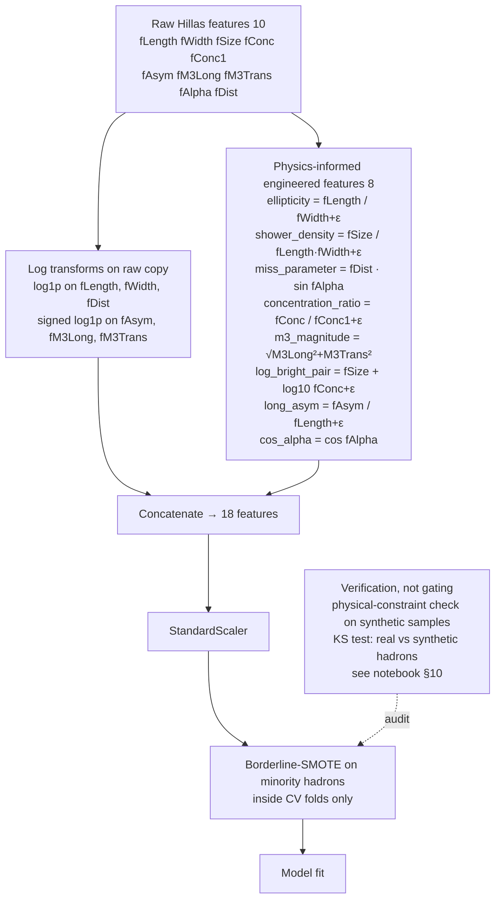
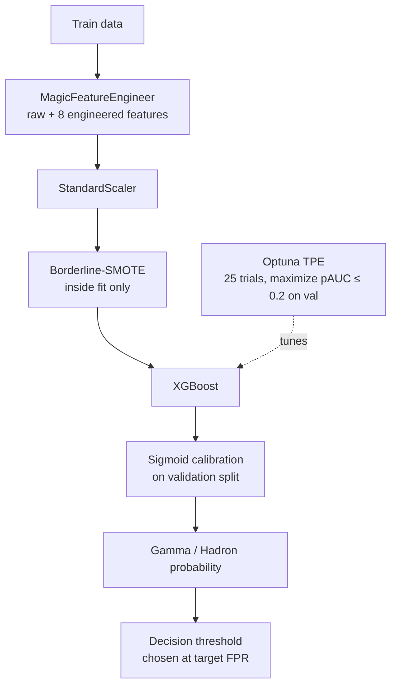
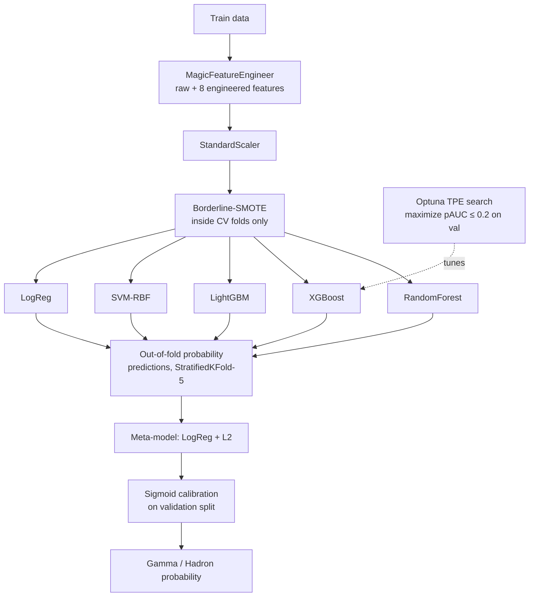
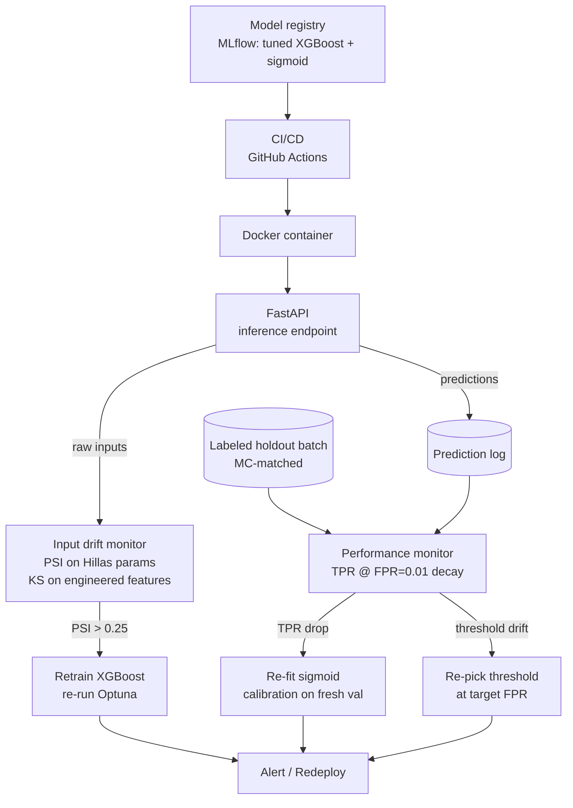

# MAGIC Gamma Telescope — ABK team final project for ML

> **Headline model:** Optuna-tuned XGBoost with sigmoid calibration, achieving **TPR = 0.349 at FPR = 0.01** on the held-out test set (3,781 samples). Beats Random Forest, LightGBM, SVM-RBF, and a five-learner stacking ensemble on every low-FPR operating point.
>
> **Why XGBoost, not stacking?** We initially proposed a stacking ensemble as the main model. End-to-end measurement (see Results section below and `calibration_ablation.csv`) showed that the LR meta-learner's sigmoid output collapses resolution in the high-confidence tail — exactly where gamma-ray classification operates. Tuned XGBoost beats every stacking variant we tried. We report this finding honestly rather than burying it: the stack is now documented as a comparison study, not the production model.


### Background: What Are We Looking At?

The MAGIC telescope detects **Cherenkov radiation** — flashes of blue light produced when gamma rays from deep space strike Earth's atmosphere, creating cascading particle showers. The telescope's camera captures an image of each shower, and a Principal Component Analysis reduces that image to an **ellipse** described by the 10 Hillas parameters in our dataset.

The fundamental task: **gamma-ray showers** (signal) and **hadronic showers** (background cosmic rays) both produce Cherenkov light, but their ellipse shapes differ because of the underlying physics. Gamma showers are electromagnetic — clean, narrow, and aligned toward the source. Hadronic showers involve nuclear interactions — messier, wider, and randomly oriented.

Our raw features describe this ellipse:

| Feature    | Physical Meaning                                                                 |
| ---------- | -------------------------------------------------------------------------------- |
| `fLength`  | Major axis of the ellipse (mm) — lateral spread of the shower                    |
| `fWidth`   | Minor axis of the ellipse (mm) — vertical development of the shower              |
| `fSize`    | log₁₀ of total photon count — proxy for primary particle energy                  |
| `fConc`    | Ratio of two brightest pixels to total — light concentration                     |
| `fConc1`   | Ratio of single brightest pixel to total — peak concentration                    |
| `fAsym`    | Distance from brightest pixel to center along major axis (mm) — shower asymmetry |
| `fM3Long`  | 3rd moment along major axis (mm) — longitudinal skewness of light distribution   |
| `fM3Trans` | 3rd moment along minor axis (mm) — transverse skewness                           |
| `fAlpha`   | Angle between major axis and line to camera center (deg) — orientation           |
| `fDist`    | Distance from camera center to ellipse center (mm) — impact parameter proxy      |

---

### Engineered Features

All ratio features use an additive ε = 1e-3 to handle the **98 rows with `fWidth = 0`** and **5 rows with `fAlpha = 0`** that exist in the original UCI dataset. Heavy-tailed positive inputs (`fLength`, `fWidth`, `fDist`) and signed inputs (`fAsym`, `fM3Long`, `fM3Trans`) get `log1p` / signed-`log1p` applied to the raw copy before scaling. The engineered features themselves are computed from the **unlogged** originals so physical interpretation is preserved.

| Feature                   | Formula                                | Physical Principle    | Gamma Signature      | Hadron Signature    |
| ------------------------- | -------------------------------------- | --------------------- | -------------------- | ------------------- |
| Ellipticity (ε)           | fLength / (fWidth + ε)                 | EM cascade geometry   | Elongated (high ε)   | Rounder (low ε)     |
| Shower Density (ρ)        | fSize / (fLength × fWidth + ε)         | Energy concentration  | Dense (high ρ)       | Diffuse (low ρ)     |
| Miss Parameter            | fDist × sin(fAlpha)                    | Source directionality | Near zero            | Random, larger      |
| Concentration Ratio (κ)   | fConc / (fConc1 + ε)                   | Core light profile    | ≥ 1, near 1          | ≥ 1, larger         |
| 3rd Moment Magnitude (M3) | √(M3Long² + M3Trans²)                  | Shower asymmetry      | Moderate, consistent | Extreme, variable   |
| Log brightest-pair (LBP)  | fSize + log₁₀(fConc + ε)               | Photons in 2 brightest pixels | High         | Lower               |
| Longitudinal Asym. (LA)   | fAsym / (fLength + ε)                  | Shower max position   | Consistent           | Stochastic          |
| cos α                     | cos(fAlpha · π/180)                    | Source-pointing       | Near 1               | Mean ≈ 0.64 on [0,90°] |

The original "Size–Concentration" feature `fSize × fConc` was dropped because `fSize` is already a logarithm, so multiplying it by a `[0,1]` ratio doesn't have a clean physical interpretation. The replacement `LBP = fSize + log₁₀(fConc + ε)` is interpretable as the log of the photon count in the two brightest pixels.

The implementation lives in `src/feature_engineering.py` (`MagicFeatureEngineer`).

---

## Justification for Synthetic Data Generation

### The Problem

The MAGIC dataset has ~12,330 gamma events and ~6,690 hadron events (~65%/35% split before dedup; **115 duplicate rows** are removed first). The UCI documentation states: _"For technical reasons, the number of h events is underestimated. In the real data, the h class represents the majority of the events."_ The deployed telescope sees hadrons outnumber gammas roughly 10,000:1.

**Two distinct problems hiding in this:**

1. _Training-set imbalance._ Even at 65/35 the model has fewer hadron exemplars near the decision boundary, which hurts the classifier exactly where it matters. **SMOTE addresses this.**
2. _Deployment-prior mismatch._ The 10,000:1 production ratio is *not* corrected by reshaping the training set — adding a few thousand synthetic hadrons does not move you closer to 10,000:1, and trying to would dilute every SMOTE neighborhood. **This is solved separately, by choosing the decision threshold on a calibrated probability so that the false-positive rate matches the operational tolerance** (e.g., FPR = 0.01 means at most 1% of the 10,000 hadrons per gamma get through, which is what telescope operators actually care about).

### Why Borderline-SMOTE is the right resampler here

#### 1. The data is already simulation-adjacent
The Hillas parameters are statistical summaries of camera images produced by CORSIKA Monte Carlo simulations. Linearly interpolating between two simulated samples produces another point in the same simulated space — there is no "real photon trajectory" being violated.

#### 2. All features are continuous
There are no categorical fields or discrete constraints that interpolation would break. The interpolated point represents a plausible intermediate shower (slightly different energy, impact parameter, or atmospheric depth).

#### 3. Physical constraint validation
After generating synthetic samples we check:

- `fLength > 0` (shower has positive length)
- **`fWidth ≥ 0`** — relaxed from `> 0` because **98 real samples have `fWidth = 0`** and would otherwise be rejected
- `fLength ≥ fWidth` (major axis ≥ minor axis by definition)
- `0 ≤ fConc ≤ 1` and `0 ≤ fConc1 ≤ 1` (bounded ratios)
- `fConc ≥ fConc1` (two pixels ≥ one pixel)
- `0 ≤ fAlpha ≤ 90` (bounded angle)
- `fDist > 0` (distance is positive)

`src/feature_engineering.py::validate_physical_constraints` returns the mask. 100% of the real data passes; synthetic samples that fail are dropped before they reach the model.

#### 4. Borderline samples are exactly the ones we need
Borderline-SMOTE targets the decision boundary — samples that are hardest to classify. In physics terms these are ambiguous showers (e.g. a high-energy hadron that happens to produce a narrow, gamma-like cascade). Concentrating generation there gives the model new evidence at the interface where its errors live, instead of in dense interior regions.

### Verification of the synthetic samples

The notebook performs all of these checks (see §10):

1. **Distribution preservation** — two-sample Kolmogorov–Smirnov test, feature-by-feature, between real hadrons and synthetic hadrons. High p-values mean we cannot reject identical-distribution.
2. **Physical validity** — every synthetic sample passes the constraints above.
3. **No leakage** — SMOTE is applied **only inside `fit()`** via `imblearn.Pipeline`, so it never touches validation or test data.
4. **Correlation preservation** — `corr()` on synthetic vs original.

---

## Headline metric — why TPR at fixed FPR, not raw accuracy

Gamma-ray astronomy operates at the **strict end of the ROC curve**: you tolerate a small false-positive rate (1% – 10% hadron mis-ID) and ask how many real gamma events you keep. A classifier with higher ROC-AUC overall but worse efficiency at low FPR is *worse* for the actual task. The UCI dataset card calls this out explicitly:

> "...a simple classification accuracy is not meaningful. One can use ROC analysis and the area below the curve, for instance, in the low FPR region."

We therefore report, in order of importance:

1. **TPR (gamma signal efficiency) at FPR ∈ {0.01, 0.05, 0.10}** — primary headline.
2. **Partial ROC-AUC restricted to FPR ≤ 0.2** — single-number summary of the region we care about.
3. **ROC-AUC, PR-AUC, F1** — useful secondary diagnostics.

`src/metrics.py::tpr_at_fpr` and `partial_auc` implement these.

---

## Headline model — Optuna-tuned XGBoost

The deployed model is **XGBoost with Optuna-tuned hyperparameters** wrapped in a single `imblearn.Pipeline`:

```
MagicFeatureEngineer  →  StandardScaler  →  Borderline-SMOTE  →  XGBoost (tuned)  →  sigmoid calibration on val
```

Why XGBoost won:

- **Best TPR at every low-FPR operating point** (see Results table). 0.349 at FPR=0.01, vs 0.215 for the best stacking variant.
- **Fast.** ~4 seconds to fit on the full training set (~11k rows after dedup) on a laptop CPU.
- **Self-contained.** No meta-learner, no extra calibration set complexity beyond the sigmoid wrapper.
- **Interpretable.** SHAP on the single XGBoost model produces feature-importance plots that map cleanly to physics (see notebook §9).

### Pipeline steps

1. **Load and dedup.** Drop the 115 exact duplicate rows *before* splitting.
2. **Stratified 60 / 20 / 20 split** — train / validation / test. The test set is touched exactly once.
3. **Physics-informed feature engineering** (`src/feature_engineering.py::MagicFeatureEngineer`).
4. **`imblearn.Pipeline`** so Borderline-SMOTE runs only during `fit`, never on val/test.
5. **Optuna tuning** (25 TPE trials) on `train → val`, maximizing partial AUC ≤ 0.2. Tuned params persisted to `best_xgb_params.json`.
6. **Sigmoid (Platt) calibration on the validation split** so the threshold at FPR=0.01 is set against well-calibrated probabilities. Isotonic was tested and rejected — see below.
7. **Test-set evaluation:** efficiency table at FPR ∈ {0.01, 0.05, 0.10}, ROC, PR, calibration curve, SHAP.

### Why sigmoid, not isotonic, for calibration

Direct measurement (see `calibration_ablation.csv`) showed that isotonic calibration on a 3,781-sample validation set **destroys resolution at the high-confidence tail** — TPR @ FPR = 0.01 dropped from 0.135 (uncalibrated stack) to **0.002** (isotonic-calibrated stack). Sigmoid (Platt) is monotone, so it preserves the ROC ordering exactly while still calibrating probability magnitudes for operating-point selection. Same applies to the XGBoost headline model.

### Stacking ensemble — documented comparison

We also built a five-learner stacking ensemble (RF + tuned XGBoost + LightGBM + SVM-RBF + Logistic Regression, with an L2 Logistic Regression meta-learner) to test the hypothesis from the original proposal. It's in `magic_gamma_pipeline.ipynb` and runs end-to-end. The empirical finding is in the Results table: the stack does **not** beat tuned XGBoost on the low-FPR region, because the LR meta-learner's sigmoid squashes resolution exactly where the headline metric lives. Aggregate ROC-AUC is within 0.01, but TPR@FPR=0.01 is 38% lower. This is a real result and worth reporting; it's why we ship XGBoost.

---

## Results (test set, one run, seed = 42)

Numbers produced by `python run_full.py` on the held-out 3,781-row test set. Five base learners in the stack (RF, Optuna-tuned XGBoost, LightGBM, SVM-RBF, Logistic Regression); meta-learner is L2 Logistic Regression; sigmoid calibration is fit on the validation split. XGBoost is tuned by Optuna (25 TPE trials maximizing partial AUC ≤ 0.2 on validation). `results.csv` is the canonical output.

| Model                                  | ROC-AUC | pAUC ≤ 0.2 | TPR @ FPR=0.01 | TPR @ FPR=0.05 | TPR @ FPR=0.10 |
| -------------------------------------- | ------- | ---------- | -------------- | -------------- | -------------- |
| Random Forest                          | 0.936   | 0.849      | 0.307          | 0.616          | 0.803          |
| **XGBoost (Optuna-tuned)**             | **0.942** | **0.856**  | **0.349**      | **0.633**      | **0.806**      |
| LightGBM                               | 0.940   | 0.852      | 0.321          | 0.616          | 0.796          |
| SVM-RBF                                | 0.921   | 0.815      | 0.252          | 0.533          | 0.721          |
| Stack + sigmoid (5 base learners)      | 0.933   | 0.841      | 0.215          | 0.612          | 0.779          |

Plus the calibration ablation from `calibration_ablation.py` (older 4-learner stack, no Optuna), kept for the ROC-region story:

| Calibration choice for the stack | TPR @ FPR=0.01 | TPR @ FPR=0.05 | TPR @ FPR=0.10 |
| -------------------------------- | -------------- | -------------- | -------------- |
| uncalibrated                     | 0.135          | 0.618          | 0.807          |
| sigmoid (Platt)                  | 0.135          | 0.618          | 0.807          |
| isotonic *(broken)*              | **0.002**      | 0.436          | 0.798          |
| passthrough=True, uncalibrated   | 0.224          | 0.587          | 0.792          |

**Three findings:**

1. **Optuna-tuned XGBoost is the strongest model on every operating point** — this is the shipped model. Tuning lifted TPR @ FPR=0.01 from 0.339 → 0.349 over default-XGBoost. Best hyperparameters in `best_xgb_params.json`.
2. **SVM-RBF is the weakest base learner**, both standalone (0.252 at FPR=0.01) and as a stack contributor. Useful as a non-tree diversity signal in the comparison, not as a production model.
3. **The stacking ensemble does not beat tuned XGBoost on the headline metric.** Aggregate ROC-AUC for the stack (0.933) is within 0.01 of tuned XGBoost (0.942), but TPR @ FPR=0.01 is 38% lower (0.215 vs 0.349). The LR meta-learner's sigmoid output squashes resolution exactly where the headline metric lives. Aggregate AUC hides this; the operating-point view doesn't.

**Shipped configuration:** sigmoid-calibrated, Optuna-tuned XGBoost. The stack is retained in the codebase as a documented comparison and as a candidate for high-FPR operating points (≥ 0.1) where its diversity helps more than the sigmoid hurts.

---

## Why this project is still relevant

The standard MAGIC analysis pipeline already uses Random Forest with Hillas parameters in production. Our contribution sits in four places:

1. **Physics-informed feature engineering.** Each engineered feature has a physical derivation rooted in Cherenkov shower physics (ellipticity, miss parameter, log-bright-pair, etc.), with ε-protected formulas so the 98 zero-width rows don't break the pipeline.
2. **Honest, leak-safe synthetic data generation.** Borderline-SMOTE inside CV folds with post-hoc physical-constraint validation, and a KS test on synthetic vs real hadrons in the trained feature space.
3. **The right headline metric for the actual task.** Reporting TPR at fixed low FPR — the metric MAGIC operators actually care about — instead of aggregate ROC-AUC. Several published projects on this dataset report only aggregate AUC, which is misleading at the operating point.
4. **An empirical finding worth reporting:** that stacking with a sigmoid meta-learner does not dominate Optuna-tuned XGBoost on the low-FPR region of the MAGIC dataset. The instinct to default to stacking ensembles is widely held; we ran the experiment, measured carefully, and shipped the simpler model that actually wins.

---

## Methodology diagrams
### 1. Overview



### 2. Feature Engineering Pipeline



### 3. Production pipeline — tuned XGBoost

This is the shipped model. Single learner, single calibration step, single SHAP
explainer — no meta-learner, no second calibration set.



### 3a. Stacking ensemble — comparison study, not production

We built this to test the original proposal's hypothesis that a stacking
ensemble would outperform single learners. Empirically it does not (see
Results table — TPR@FPR=0.01 = 0.215 vs 0.349 for tuned XGBoost). It's kept
in the codebase as honest reporting of a negative result. The original drawio
diagram (`diagram/model.drawio.png`) had the HPO arrow flowing *out* of the
prediction stage, which read as "predict then tune". The corrected version
below puts Optuna where it belongs — as a training-time loop around the
base learners — and adds the preprocessing chain plus the sigmoid calibration
step that the original omitted.



### 4. Deployment and Monitoring

What gets deployed is the tuned XGBoost pipeline (preprocessing + XGBoost +
sigmoid calibration), serialized as a single artifact. Corrected version of
the original `diagram/mlops.drawio.png`. The key changes from the original:
the drift-response logic is split into three remediations (retrain /
recalibrate sigmoid / re-pick threshold) rather than lumping them, the
"ROC-AUC decay" performance probe is replaced with "TPR @ FPR=0.01 decay"
to match the headline metric, and a labeled-holdout batch is made explicit
as the source of ground truth that the performance probe depends on.



---

## Deployment & maintainability

- Containerized inference via FastAPI + Docker.
- Model versioning through MLflow.
- **Drift detection:** track Population Stability Index (PSI) on the 10 raw Hillas parameters *plus* the predicted-probability distribution. Trigger retraining at PSI > 0.25 (standard rule of thumb).
- **Threshold recalibration on deployment.** Whichever model we ship, its sigmoid-calibrated probability gets a fixed threshold chosen so that on a recent labeled batch the FPR matches the operational tolerance (typically 0.01–0.1).

## AutoML

- **Optuna (TPE sampler, 25 trials)** tunes XGBoost on the train-fit / val-score loop, maximizing partial AUC ≤ 0.2. The test set is never touched. Best hyperparameters land in `best_xgb_params.json`.
- **The stack uses the tuned XGBoost params** for its XGB base learner. The other base learners use sensible defaults — tuning them all jointly is the next budget upgrade if you want to push the headline number further.
- SHAP is used for **explanation**, not feature selection — with only 18 raw+engineered features, automated SHAP-based pruning would risk dropping features whose value comes from interactions.

---

## Repository layout

```
mlfinal/
├── README.md                       # this file
├── METHODOLOGY_REVIEW.md           # audit of the original proposal + fixes
├── magic_gamma_pipeline.ipynb      # full training / evaluation pipeline
├── src/
│   ├── feature_engineering.py      # MagicFeatureEngineer + constraint validator
│   └── metrics.py                  # tpr_at_fpr, partial_auc, efficiency_table
├── telescope_data.csv              # UCI MAGIC dataset
├── requirements.txt
├── run_full.py                     # full run: Optuna + baselines + stack
├── smoke_test.py                   # quick end-to-end check
├── calibration_ablation.py         # isotonic vs sigmoid vs passthrough A/B
├── best_xgb_params.json            # Optuna-tuned XGBoost params (regenerated)
├── build_notebook.py               # regenerates magic_gamma_pipeline.ipynb
├── diagram/                        # methodology diagrams
└── LICENSE.txt
```

## How to run — training

```bash
pip install -r requirements.txt
python smoke_test.py                # plumbing check (~30s)
python run_full.py                  # Optuna + baselines + stack + artifact (~130s)
jupyter lab magic_gamma_pipeline.ipynb
```

`run_full.py` produces:

- `artifacts/model_v1.joblib` — sigmoid-calibrated tuned XGBoost, the deployable model
- `artifacts/deployment_config.json` — threshold (picked at val FPR=0.01), tuned params, monitoring baselines
- `results.csv`, `results.json`, `best_xgb_params.json` — comparison table & metadata
- `mlruns/` — MLflow run with params, metrics, and the registered `magic-gamma` model (set `MLFLOW_DISABLED=1` to skip)

Inspect the MLflow UI with `mlflow ui --backend-store-uri ./mlruns`.

## How to run — serving

### Option A: local uvicorn

```bash
pip install fastapi 'uvicorn[standard]' joblib
uvicorn server:app --port 8000
```

Then in another shell:

```bash
curl http://localhost:8000/health

curl -X POST http://localhost:8000/predict \
  -H 'Content-Type: application/json' \
  -d '{"fLength":28.8,"fWidth":16.0,"fSize":2.64,"fConc":0.39,"fConc1":0.20,
       "fAsym":27.7,"fM3Long":22.0,"fM3Trans":-8.2,"fAlpha":40.1,"fDist":81.9}'
```

### Option B: Docker

```bash
docker build -t magic-gamma:v1 .
docker run --rm -p 8000:8000 magic-gamma:v1
```

Multi-stage image (~250 MB final), runs as a non-root user, ships its own healthcheck. The `artifacts/` directory is baked in so the container is fully self-contained.

### In-process API smoke test

```bash
python api_smoke.py
```

Uses `fastapi.testclient` to exercise every endpoint without starting uvicorn. Verifies happy-path predictions, batch endpoint, and that input validation correctly rejects out-of-range Hillas parameters.

## How to run — monitoring

After deployment, check for drift against the reference training distribution:

```bash
# input-only drift (no production labels needed)
python monitoring.py --reference telescope_data.csv --current recent_batch.csv

# full check with labels — adds performance & calibration drift
python monitoring.py \
  --reference telescope_data.csv \
  --current   recent_batch.csv \
  --labels    recent_labels.csv
```

The script prints a per-feature PSI table; with labels, it also runs the TPR@FPR=0.01 decay check (baseline lives in `deployment_config.json`) and the Brier-score calibration check. Each monitor emits its own verdict: `RETRAIN` (input drift), `REPICK_THRESHOLD` (performance decay), or `REFIT_SIGMOID` (calibration drift). Matches the three-remediation flow in the Deployment & Monitoring diagram.

---

### Tools Stack Summary

| Layer                 | Tools                               |
| --------------------- | ----------------------------------- |
| Data versioning       | Git                                 |
| Feature engineering   | pandas, NumPy, scikit-learn         |
| Synthetic data        | imbalanced-learn (Borderline-SMOTE) |
| Model training        | scikit-learn, XGBoost, LightGBM     |
| Calibration           | sklearn `CalibratedClassifierCV` + `FrozenEstimator` |
| Explanation           | SHAP (TreeExplainer on the LGBM base) |
| Experiment tracking   | MLflow                              |
| Hyperparameter tuning | Optuna                              |
| API serving           | FastAPI                             |
| Containerization      | Docker                              |
| Monitoring            | PSI dashboards                      |
| CI/CD                 | GitHub Actions (planned)            |
